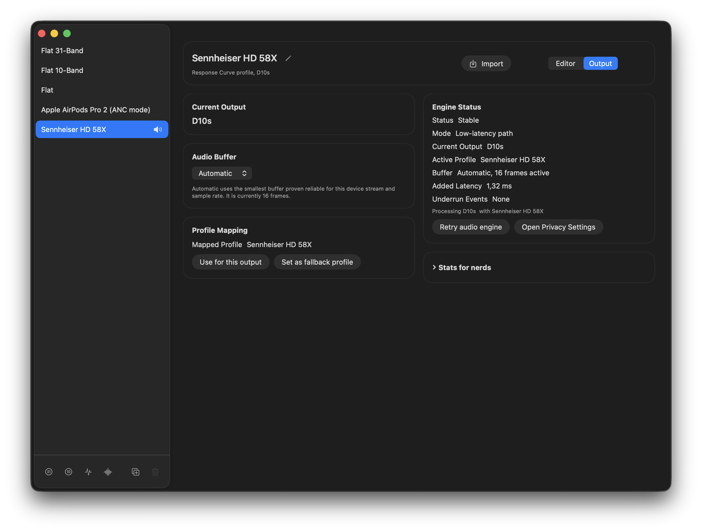
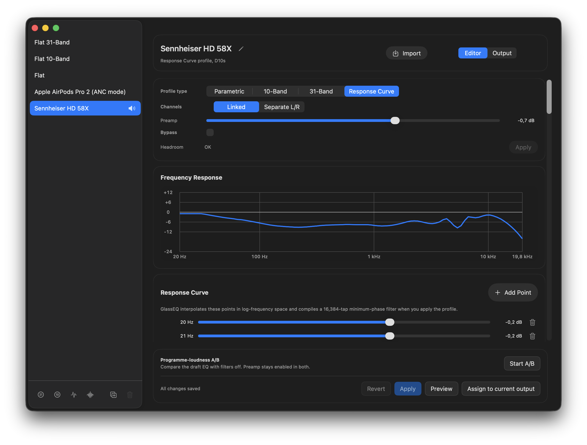
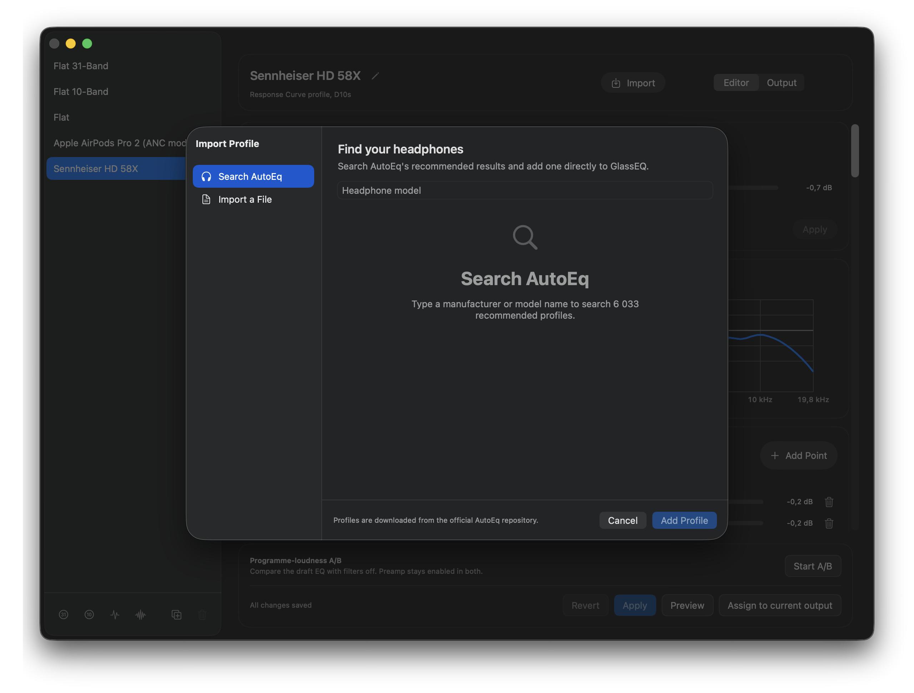
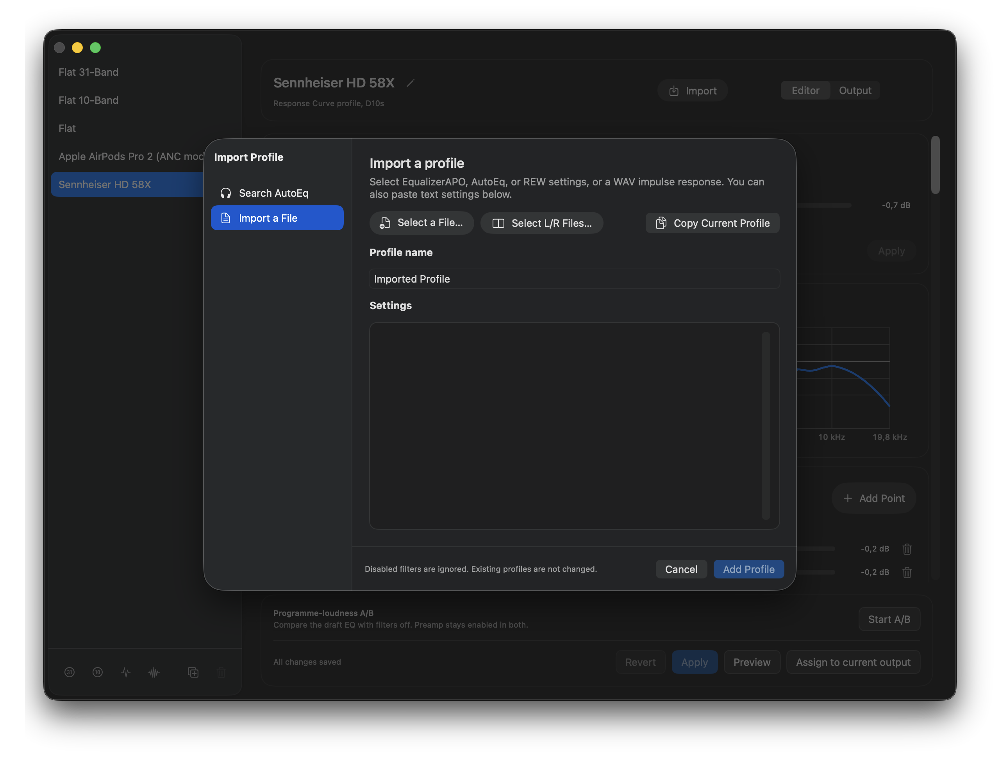
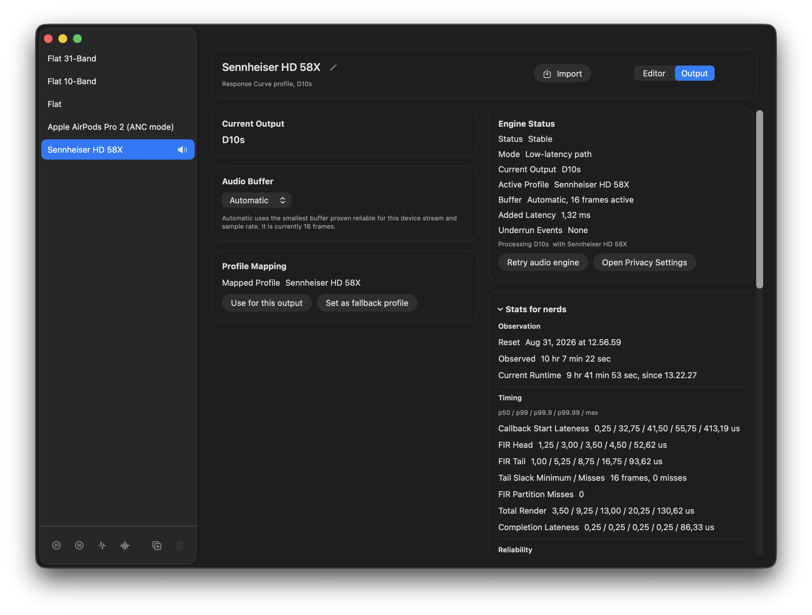
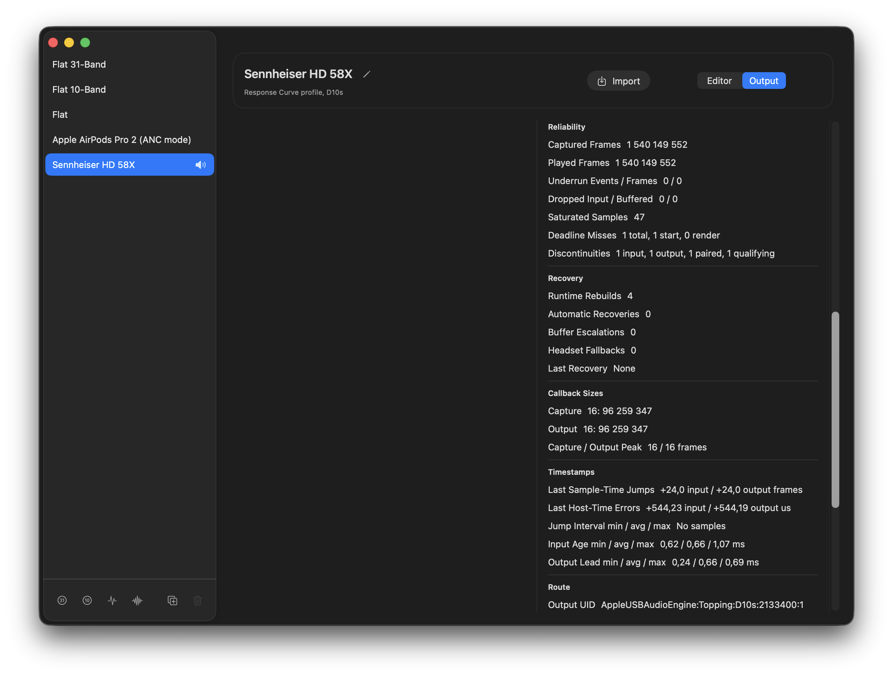
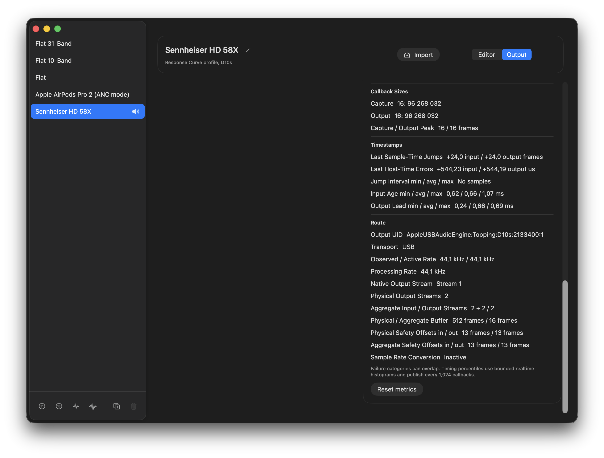

# GlassEQ alpha-0.9.2 release notes

This is a technical alpha for Apple Silicon Macs running macOS 26. It is also a much larger release than the patch number suggests. Alpha-0.9.2 replaces the normal playback path, adds two new ways to build and import EQ profiles, makes profile comparisons fairer, and puts considerably more evidence about the realtime path in the UI.

## Distribution warning

This build is ad hoc-signed, not Developer ID signed, and not notarized. macOS Gatekeeper will reject it by default. Install it only if you are comfortable testing ad hoc-signed macOS software and granting system audio capture permission.

## Changes since alpha-0.9

- Normal-rate outputs now capture, process, and play audio in one private aggregate-device callback driven by the physical output clock. This removes the separate application-level playback queue from the fast path.
- Automatic buffer mode starts at 16 frames when the route supports it, verifies the applied Core Audio buffer, and moves to a safer setting only after measured instability. Fixed buffer choices remain fixed unless GlassEQ needs a temporary recovery setting.
- Aggregate startup now establishes the physical output path before attaching the process tap when another application is already playing. This avoids disrupting existing Core Audio clients on hardware that reacted badly to the old creation order.
- Profile changes publish complete, prewarmed DSP banks and crossfade between them without allocating, locking, or releasing owned state in the render callback. A watchdog rebuilds one stalled engine and returns to normal dry playback if the replacement also stalls.
- Response Curve profiles use minimum-phase convolution. GlassEQ can compile a dense magnitude curve or render an imported mono or stereo WAV impulse response without adding a fixed tap-to-output buffer.
- The new guided import sheet can search AutoEq's recommended results, import editable parametric filters or a full response curve, parse pasted or saved EqualizerAPO and REW text, and combine separate left and right files.
- Programme-loudness A/B comparison matches the loudness of the equalized and filters-off paths before switching between them. The profile preamp remains active on both sides, so louder no longer gets a free win.
- The Output tab now separates the useful everyday status from a much deeper **Stats for nerds** view with render percentiles, FIR timing and deadline margin, callback histograms, route events, stream layouts, safety offsets, and recovery history.
- Imports and profile stores now enforce byte, tap-count, sample-rate, and schema bounds before large allocations or DSP preparation. Settings helper validation, failed Core Audio cleanup, and dry-playback restoration are stricter too.

## One clock on the normal path

Alpha-0.9 bridged the process tap and physical output with a bounded ring buffer and continuously corrected for drift between their clocks. That remains the compatibility path for unsettled low-rate headset routes, but normal-rate outputs no longer need it.

Alpha-0.9.2 creates one private aggregate containing the physical output and process taps. The physical device owns the clock, and one Core Audio callback receives the system mix, applies the active EQ bank, and writes the result directly to the output. There is no separate playback queue or asynchronous sample-rate converter on this path.

The aggregate requests 16-frame callbacks without changing the physical device's shared buffer setting. GlassEQ then qualifies the result before fading in. Automatic mode remembers the smallest reliable setting for each device stream and sample rate, and it can climb through safer buffer sizes when the measured route requires it.



In one pre-release run, Automatic mode kept a USB DAC at 16 frames through a 9 hour 41 minute runtime. The surrounding observation window reached 10 hours 7 minutes. That is one machine and one route, not a promise that every driver will hold the same setting. It does show what the new qualification, recovery, and diagnostics work can sustain and, just as importantly, let us inspect afterward.

## Response curves and impulse responses

GlassEQ now has a fourth profile mode. A Response Curve stores frequency and gain points, converts them into a 16,384-tap minimum-phase impulse, and renders the result with a vectorized direct head plus partitioned FFT tail. The direct head produces the first sample immediately, so convolution adds work but no fixed buffering.

Imported WAV impulse responses use the same renderer. Mono and stereo files are supported, and two mono files can be combined into independent left and right channels. GlassEQ retains the source sample rate and never silently resamples, truncates, or retimes an impulse response. Preview, Apply, A/B comparison, and output mapping require the active DSP rate to match the imported response.

Both convolution sources use the same realtime publication contract as ordinary biquad profiles. GlassEQ prepares and prewarms a complete replacement outside the callback, then makes one short, sample-accurate transition while audio continues.



## A guided import flow

The import sheet brings the previously separate import paths into one place:

- Search AutoEq by headphone model and import its recommended result as editable parametric filters or a Response Curve.
- Paste EqualizerAPO or REW text directly.
- Choose saved text files through the macOS file picker.
- Import mono or stereo WAV impulse responses.
- Combine separate left and right text or mono WAV files into one stereo profile.





Remote catalogue responses, downloaded profiles, text input, and audio files are bounded and validated before GlassEQ commits them to the profile library or prepares DSP state. Files remain behind explicit sandbox file selection, and AutoEq profiles stay local after import.

## Fairer A/B comparisons

The editor can now compare a draft profile with the same profile's filters disabled. Both branches keep the same preamp, pass through BS.1770 K-weighting, and measure the same rolling three-second programme window. GlassEQ attenuates only the louder side, then crossfades between the matched signals.

The comparison is temporary. It does not rewrite the profile, store measured gains, or leave the renderer in a special state after it ends.

## Safer startup and recovery

Some active USB audio clients reacted badly when the process tap was already present while GlassEQ created its aggregate. Alpha-0.9.2 can instead start a physical-only output path at the incumbent buffer size, attach the tap to that running aggregate, verify that physical inputs remain disabled, and only then request the private low-latency buffer.

Each step has a bounded failure path. GlassEQ keeps the tap muted only while it has a functioning output path, restores device state it owns, and returns to normal dry system playback when startup, qualification, handoff, or recovery cannot complete safely. Low-rate Bluetooth headset routes retain the separate-clock backend while their timing settles and promote only after their physical clock and combined aggregate qualify.

The DSP path also has an external watchdog. One three-second render stall triggers a single rebuild. A second stall within 60 seconds stops GlassEQ processing instead of repeatedly rebuilding or leaving another process muted behind an unread tap.

## Stats for nerds

The normal Output view still shows the current route, profile, engine state, buffer, measured added latency, and underrun count. The expanded diagnostics reveal what sits underneath that summary:

- Callback-start, render-completion, total-render, FIR-head, and FIR-tail timing percentiles through p99.99, plus maxima.
- Tail completion margin and deadline misses for partitioned convolution.
- Requested, applied, and observed callback sizes, including histograms and discontinuities.
- Route rebuilds, promotions, fallbacks, buffer recoveries, watchdog activity, and the reason for the current operating point.
- Physical and aggregate stream layouts, channel mapping, buffer sizes, sample rates, and safety offsets.

Metrics can be reset at one visible timestamp so a listening or stress test has a clean observation window. App-owned recovery history survives engine replacement, while callback and frame counters describe only the current runtime.

The long D10s run makes those fields less abstract. GlassEQ captured and played 1,540,149,552 frames with zero underrun frames, dropped input frames, or dropped buffered frames. The convolution tail recorded no partition or deadline misses. All 96 million observed capture and output callbacks contained 16 frames. One callback started after its deadline, but no render completed late enough to miss its deadline, and Automatic mode never escalated the buffer.







## Supported alpha target

- macOS 26.0 or newer.
- Apple Silicon / arm64 only.

## Known issues

- Gatekeeper rejection is expected because the app is not notarized.
- System audio capture permission may require manual cleanup or another launch on test machines.
- Core Audio behavior still varies by device and driver. Please report the output model, macOS version, sample rate, selected buffer mode, and relevant diagnostics with hardware-specific audio problems.
- AirPlay outputs are not yet supported.
- Imported impulse responses work only when their source rate matches the active DSP processing rate.
- There are no automatic updates, crash reporting, or telemetry.
- There is no x86_64 build.

## Build artifact

The release script writes:

```sh
.build/dist/GlassEQ-alpha-0.9.2-macos26-arm64.zip
.build/dist/GlassEQ-alpha-0.9.2-macos26-arm64.zip.sha256
```
