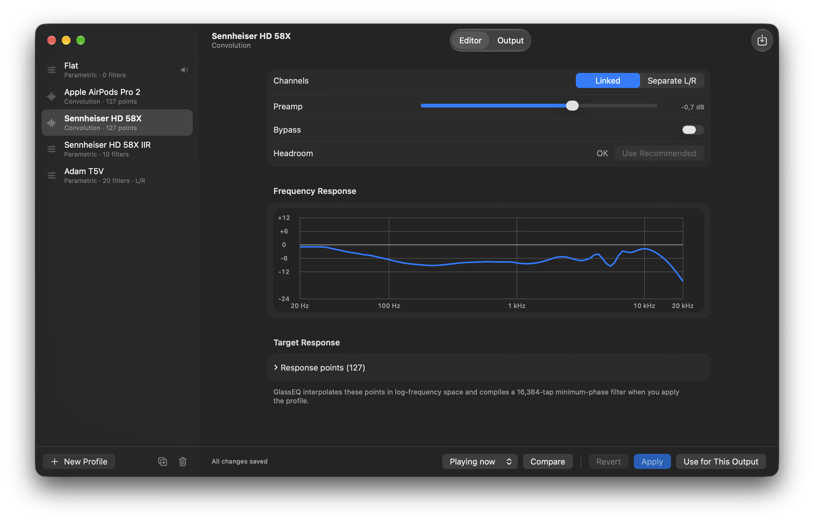
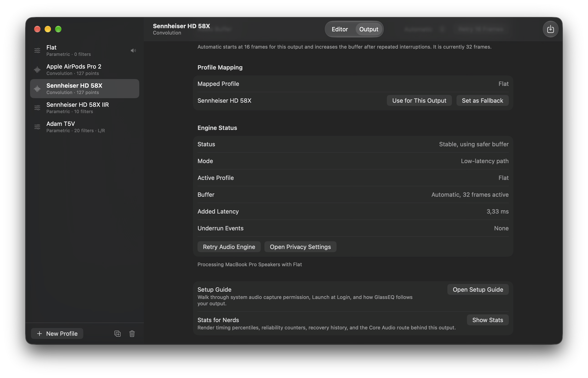
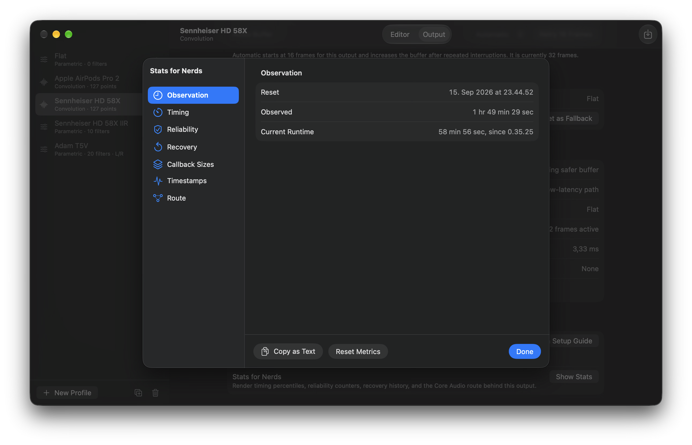
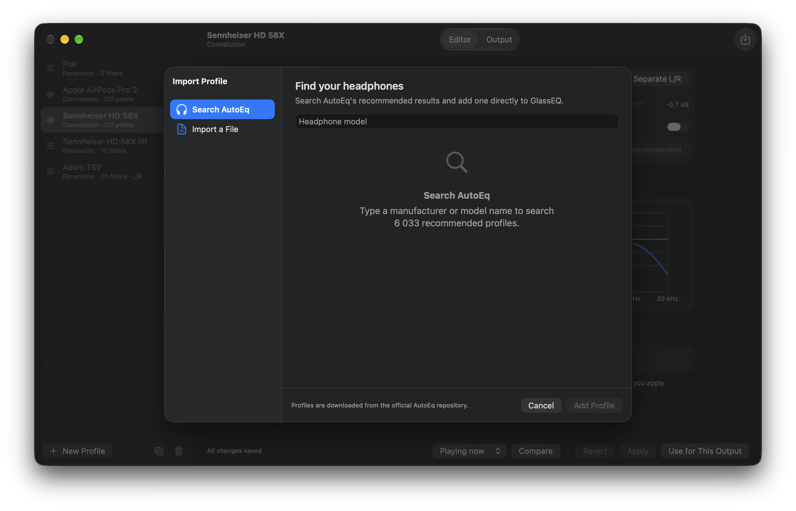
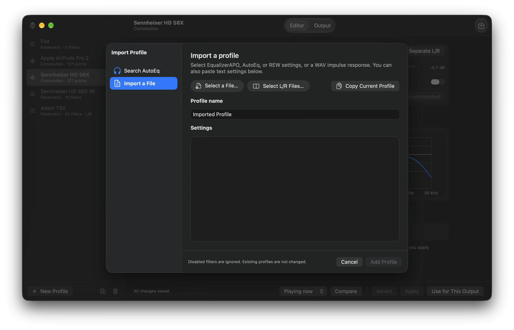
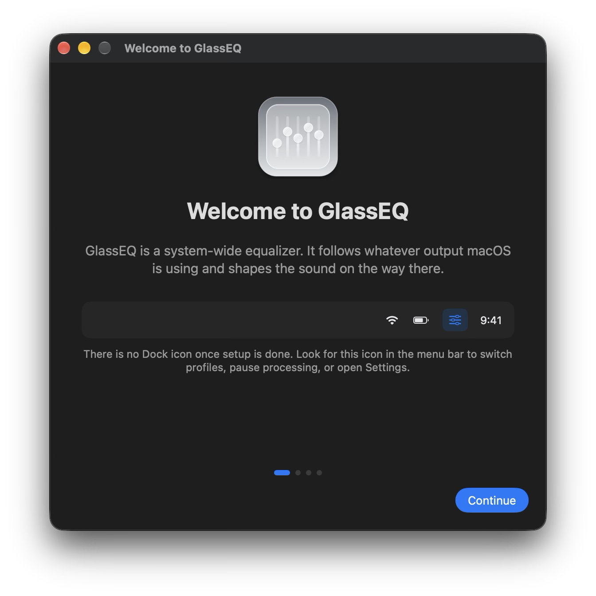
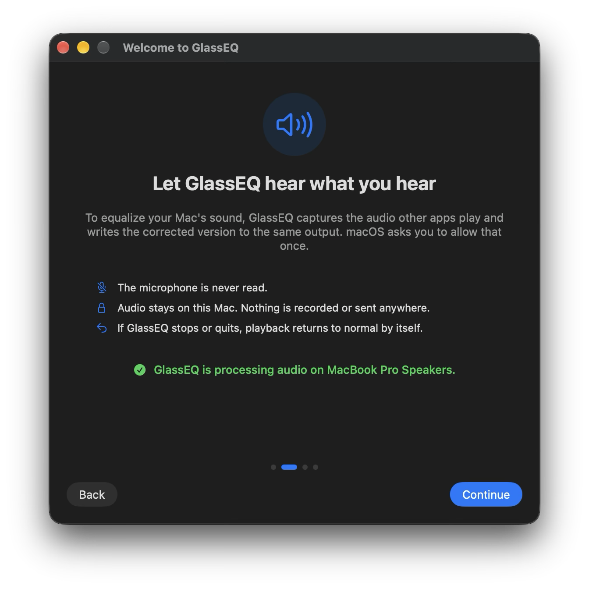
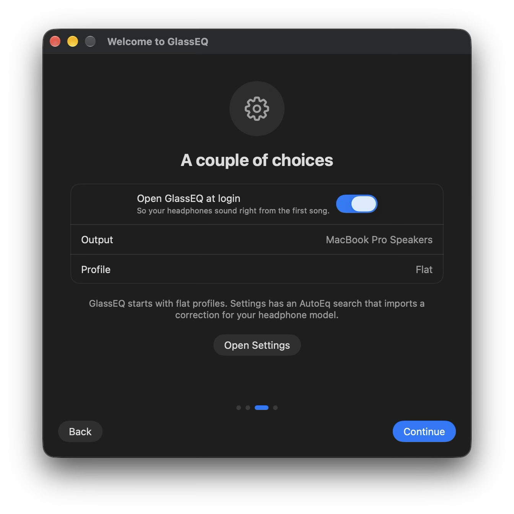

# GlassEQ beta-0.9.3

Beta-0.9.3 updates the Settings window, speeds up profile editing, and simplifies listening comparisons. It also includes the audio recovery and licensing work added since alpha-0.9.2.

## Settings and profile editing

Settings uses a native sidebar, toolbar, and grouped forms. The selected profile is easier to spot, and comparison controls sit beside Apply and Revert.

Graph and headroom calculations run in the background and are cached for profile switching. The editor reuses its controls, and convolution response points stay collapsed until expanded, reducing the work needed to open a large curve.

The Output tab groups profile mapping, audio status, and recovery controls. Stats for Nerds and profile import use sidebar navigation, with separate pages for AutoEq search and file import.

Output, diagnostics, and import screenshots

## Listening comparisons

Compare replaces Preview. Choose Playing now to compare the draft with the active profile, or Filters off to hear the draft with its filters removed and its preamp retained. Both choices use loudness matching. Stopping the comparison returns to the active profile.

Convolution references receive their full audio-history warm-up before they become audible, so selecting one early keeps the draft playing. Profile names remain locked during comparison and while the profile store is read-only.

## Setup and audio recovery

- Onboarding pages scroll when needed, keeping permission-recovery buttons reachable.
- Builds configured for licensing include activation in the setup guide. Source builds without licensing configuration skip that step.
- Audio output changes preserve stop and rebuild ordering, including rate changes and temporary route changes.
- Automatic buffering starts at 64 frames for Bluetooth outputs and 16 frames for other outputs. Explicit buffer choices remain available.
- On macOS 27, Output settings explain that Bluetooth audio may use 256 frames despite a smaller selection. The active size and saved preference are shown without assuming that the selected size became unstable.

Setup guide screenshots

## Installation and limitations

The target remains macOS 26 or newer on Apple Silicon. The standard source package is ad hoc-signed and is not notarized. AirPlay, Intel builds, automatic updates, and crash reporting remain unsupported.

AirPods Pro 2 on macOS 27.0 can remain at 256 frames after playback, even after retrying the engine. No reliable workaround is established. See the [measurements and Apple feedback reference](AggregateClockExperiment.md#macos-27-airpods-buffer-clamp).

Download `GlassEQ-beta-0.9.3-macos26-arm64.zip` from the [beta-0.9.3 release](https://github.com/juhokoskela/GlassEQ/releases/tag/beta-0.9.3). It includes the app, GPL license, build revision, and matching source archive. Move the app to `/Applications`, then use **System Settings → Privacy & Security → Open Anyway** to allow its first launch.

See the [installation instructions](../README.md#download--install), [distribution notes](Distribution.md), and [beta testing guide](BetaTesting.md).
